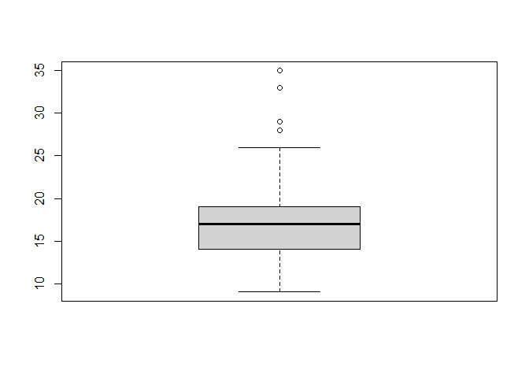

## 라이브러리 불러오기


```r
library(dplyr)
```

```
## 
## 다음의 패키지를 부착합니다: 'dplyr'
```

```
## The following objects are masked from 'package:stats':
## 
##     filter, lag
```

```
## The following objects are masked from 'package:base':
## 
##     intersect, setdiff, setequal, union
```

```r
library(ggplot2)
```

## 데이터 불러오기

-   데이터를 불러오세요


```r
exam_na <- read.csv("data/exam_na.csv")
str(exam_na)
```

```
## 'data.frame':	5 obs. of  5 variables:
##  $ id     : int  1 2 3 4 5
##  $ sex    : chr  "M" "F" "F" "M" ...
##  $ korean : int  87 92 95 NA 87
##  $ english: int  NA 95 92 84 NA
##  $ math   : int  82 93 90 80 88
```

## 결측치 확인 후 빈도 구하기

### (1) 결측치 확인


```r
is.na(exam_na)
```

```
##         id   sex korean english  math
## [1,] FALSE FALSE  FALSE    TRUE FALSE
## [2,] FALSE FALSE  FALSE   FALSE FALSE
## [3,] FALSE FALSE  FALSE   FALSE FALSE
## [4,] FALSE FALSE   TRUE   FALSE FALSE
## [5,] FALSE FALSE  FALSE    TRUE FALSE
```

### (2)결측치 빈도 구하기

-table():빈도구하기


```r
table(is.na(exam_na))
```

```
## 
## FALSE  TRUE 
##    22     3
```

```r
table(is.na(exam_na$korean))
```

```
## 
## FALSE  TRUE 
##     4     1
```

```r
summary(is.na(exam_na))
```

```
##      id             sex            korean         english       
##  Mode :logical   Mode :logical   Mode :logical   Mode :logical  
##  FALSE:5         FALSE:5         FALSE:4         FALSE:3        
##                                  TRUE :1         TRUE :2        
##     math        
##  Mode :logical  
##  FALSE:5        
## 
```

```r
summary(exam_na)
```

```
##        id        sex                korean         english           math     
##  Min.   :1   Length:5           Min.   :87.00   Min.   :84.00   Min.   :80.0  
##  1st Qu.:2   Class :character   1st Qu.:87.00   1st Qu.:88.00   1st Qu.:82.0  
##  Median :3   Mode  :character   Median :89.50   Median :92.00   Median :88.0  
##  Mean   :3                      Mean   :90.25   Mean   :90.33   Mean   :86.6  
##  3rd Qu.:4                      3rd Qu.:92.75   3rd Qu.:93.50   3rd Qu.:90.0  
##  Max.   :5                      Max.   :95.00   Max.   :95.00   Max.   :93.0  
##                                 NA's   :1       NA's   :2
```

## 결측치 처리 방법

-제거하고 처리하기 -다른 값으로 대체하기 +평균입력

### (1)결측치를 제외하고 분석하기 -p160 na.rm=T


```r
mean(exam_na$korean,na.rm = T)
```

```
## [1] 90.25
```

-na.omit() -결측치가 있는 행을 모두 제거 +가급적 쓰지 말것

-filter()활용 +is.na(korea)


```r
exam_na %>% filter(is.na(korean))
```

```
##   id sex korean english math
## 1  4   M     NA      84   80
```

-이번에는 !is.na(korean)을 적용한다


```r
exam_na %>% filter(!is.na(korean))
```

```
##   id sex korean english math
## 1  1   M     87      NA   82
## 2  2   F     92      95   93
## 3  3   F     95      92   90
## 4  5   F     87      NA   88
```

### (2) 결측치를 다른 값으로 대체하기

-   imputation 참고자료
    -   [A Solution to Missing Data: Imputation Using R](https://www.kdnuggets.com/2017/09/missing-data-imputation-using-r.html)
    -   [R 결측값(NA) 제거, 대체 방법](https://velog.io/@lifeisbeautiful/R-%EA%B2%B0%EC%B8%A1%EA%B0%92NA-%EC%A0%9C%EA%B1%B0-%EB%8C%80%EC%B2%B4-%EB%B0%A9%EB%B2%95)

## 이상치

-데이터의 특정 값이 뭔가 "이상"이 있다. 
 -case 1: 정해진 범주에서 벗어난 데이터 
          ex)2월 31일 
 -case 2: 숫자 /아웃라이어(outlier)/극단값 
          ex) 평균임금에서 삼성 이재용이 들어가면 안됨


```r
mpg1_out<-read.csv("data/mpg1_out.csv")
glimpse(mpg1_out)
```

```
## Rows: 234
## Columns: 3
## $ trans <int> 1, 2, 2, 1, 1, 2, 1, 2, 1, 2, 1, 1, 2, 1, 2, 1, 1, 1, 1, 3, 1, 1…
## $ drv   <chr> "f", "f", "f", "f", "f", "f", "f", "4", "4", "4", "4", "4", "5",…
## $ cty   <int> 18, 21, 20, 21, 16, 18, 18, 18, 16, 20, 19, 15, 17, 17, 15, 15, …
```

-trans의 빈도의갯수를 구하면 1이 몇개 2가 몇개 3이 몇개가 나온다


```r
table(mpg1_out$trans)
```

```
## 
##   1   2   3 
## 154  76   4
```


-만약 3을 그냥 제거하고 싶으면 다음과 같이 해도 된다.
  -mpg1_out %>% filter(trans !=3)


-ifelse란? 
 -만약\~라면 내가 무엇을 할 것이다.(가정법) 
 -만약 trans의 값이 3이라면 결측치로 바꿔주세요.나머지는 그대로 유지하세요.


```r
mpg1_out$trans<-ifelse(mpg1_out$trans == 3 ,NA ,mpg1_out$trans)

table(is.na(mpg1_out$trans))
```

```
## 
## FALSE  TRUE 
##   230     4
```

-결측치 제거


```r
result <-mpg1_out %>% filter(!is.na(trans))
table(is.na(result$trans))
```

```
## 
## FALSE 
##   230
```

### 극단치 처리

-숫자 데이터 boxplot() -boxlot() 함수를 통해서 극단치가 있는지 없는지 확인 가능 -IQR:3사분위-1사분위 -경계값:IQR+IQR*1.5 상한/IQR-IQR*1.5


```r
mpg1<- read.csv("data/mpg1.csv")
boxplot(mpg1$cty)
boxplot(mpg1$cty)$stats
```

<!-- -->

```
##      [,1]
## [1,]    9
## [2,]   14
## [3,]   17
## [4,]   19
## [5,]   26
```
## ggplot2강의
-데이터 불러오기

```r
library(readxl)
library(ggplot2)
who_disease <- read_xlsx("data/who_disease.xlsx")

 #기본 시각화
ggplot(who_disease,aes(x = year, y = cases)) +
         geom_point()
```

<!-- -->

```r
#옵션 1.투명도
ggplot(who_disease,aes(x = year, y = cases)) +
         geom_point(alpha=0.1)
```

<!-- -->

```r
 #옵션 2.색상 변화
ggplot(who_disease,aes(x = year, y = cases)) +
         geom_point(alpha= 0.1, colour="#0472D4")
```

<!-- -->
- colour 입력 위치는 다양하다.
 +geom_point(colour = red)
 +aes (x , y, colour = 컬럼명)
 

```r
str(iris)
```

```
## 'data.frame':	150 obs. of  5 variables:
##  $ Sepal.Length: num  5.1 4.9 4.7 4.6 5 5.4 4.6 5 4.4 4.9 ...
##  $ Sepal.Width : num  3.5 3 3.2 3.1 3.6 3.9 3.4 3.4 2.9 3.1 ...
##  $ Petal.Length: num  1.4 1.4 1.3 1.5 1.4 1.7 1.4 1.5 1.4 1.5 ...
##  $ Petal.Width : num  0.2 0.2 0.2 0.2 0.2 0.4 0.3 0.2 0.2 0.1 ...
##  $ Species     : Factor w/ 3 levels "setosa","versicolor",..: 1 1 1 1 1 1 1 1 1 1 ...
```

```r
ggplot(iris, aes( x = Sepal.Length,
                  y = Sepal.Width,
                  colour =Species,
                  size = Petal.Length))+
  geom_point()
```

<!-- -->
 
 -산점도 : x축 수치형 연속형 데이터, y축 수치형 연속형 데이터 
 
 -히스토그램
  +질병데이터 region = AMR , year = 1980, disease = 백일해(pertussis) cases>0

```r
library(dplyr)
str(who_disease)
```

```
## tibble [43,262 × 6] (S3: tbl_df/tbl/data.frame)
##  $ region     : chr [1:43262] "EMR" "EUR" "AFR" "EUR" ...
##  $ countryCode: chr [1:43262] "AFG" "ALB" "DZA" "AND" ...
##  $ country    : chr [1:43262] "Afghanistan" "Albania" "Algeria" "Andorra" ...
##  $ disease    : chr [1:43262] "measles" "measles" "measles" "measles" ...
##  $ year       : num [1:43262] 2016 2016 2016 2016 2016 ...
##  $ cases      : num [1:43262] 638 17 41 0 53 0 0 2 99 27 ...
```

```r
who_disease %>% 
  filter(region == 'AMR',
         year == 1980,
         disease == 'pertussis',
         cases >0)->data5

ggplot(data5, aes(x = cases))+
     geom_histogram(fill ="pink")
```

```
## `stat_bin()` using `bins = 30`. Pick better value with `binwidth`.
```

<!-- -->

```r
ggplot(data5, aes(x = country, y = cases))+
     geom_col(fill ="blue")+
  #옵션
     coord_flip()
```

<!-- -->
히스토그램 그리기 

```r
ggplot(who_disease, aes(region))+
  geom_bar() 
```

<!-- -->

```r
ggplot(who_disease, aes(disease)) + 
  geom_bar()
```

<!-- -->


 ## ggplot()정교하게 그리기
  -산점도 그리기

```r
ggplot(data = diamonds, aes(x = carat,
                            y = price,
                            col =cut))+
   geom_point()
```

<!-- -->
  - 막대그래프에 2개 범주 내용 반영하기

```r
ggplot(diamonds, aes(x = color, fill =cut))+
  geom_bar()
```

<!-- -->


```r
ggplot(diamonds, aes(x = color, fill =cut)) +
  geom_bar(position = "fill")
```

<!-- -->

-P219
선 그래프에 2개 범주 내용 반영


```r
leisure <- read.csv("data/leisure.csv")
str(leisure)
```

```
## 'data.frame':	200 obs. of  3 variables:
##  $ age    : int  2 2 3 3 4 4 5 5 6 6 ...
##  $ sex    : chr  "female" "male" "female" "male" ...
##  $ expense: num  25.8 21 30 16.3 25.7 ...
```


```r
ggplot(data = leisure, aes(x = age, y = expense, col = sex)) + 
  geom_line(size = 1.5, linetype = 3)
```

<!-- -->


### 막대그래프의 순서 변경
-reorder()

```r
mpg1<- read.csv("data/mpg1.csv", stringsAsFactors = F)
drv_hwy <-mpg1 %>% 
 group_by(drv) %>% 
 summarise(mean_hwy=mean(hwy))

drv_hwy
```

```
## # A tibble: 3 × 2
##   drv   mean_hwy
##   <chr>    <dbl>
## 1 4         19.2
## 2 f         28.2
## 3 r         21
```

```r
# 기본 그래프
ggplot(data = drv_hwy, aes(x = drv, y = mean_hwy)) + 
  geom_col()
```

<!-- -->

```r
ggplot(data = drv_hwy, aes(x = reorder(drv, mean_hwy), # 오름차순
                           y = mean_hwy)) + 
  geom_col()
```

<!-- -->

```r
ggplot(data = drv_hwy, aes(x = reorder(drv, -mean_hwy), # 내림차순
                           y = mean_hwy)) + 
  geom_col() + 
  labs(
    title = "그래프 제목을 입력하세요", 
    subtitle = "그래프 소제목을 입력하세요", 
    x = "x변수명을 입력하세요", 
    y = "y변수명을 입력하세요", 
    caption = "데이터 출처를 입력하세요"
  )
```

<!-- -->

 
